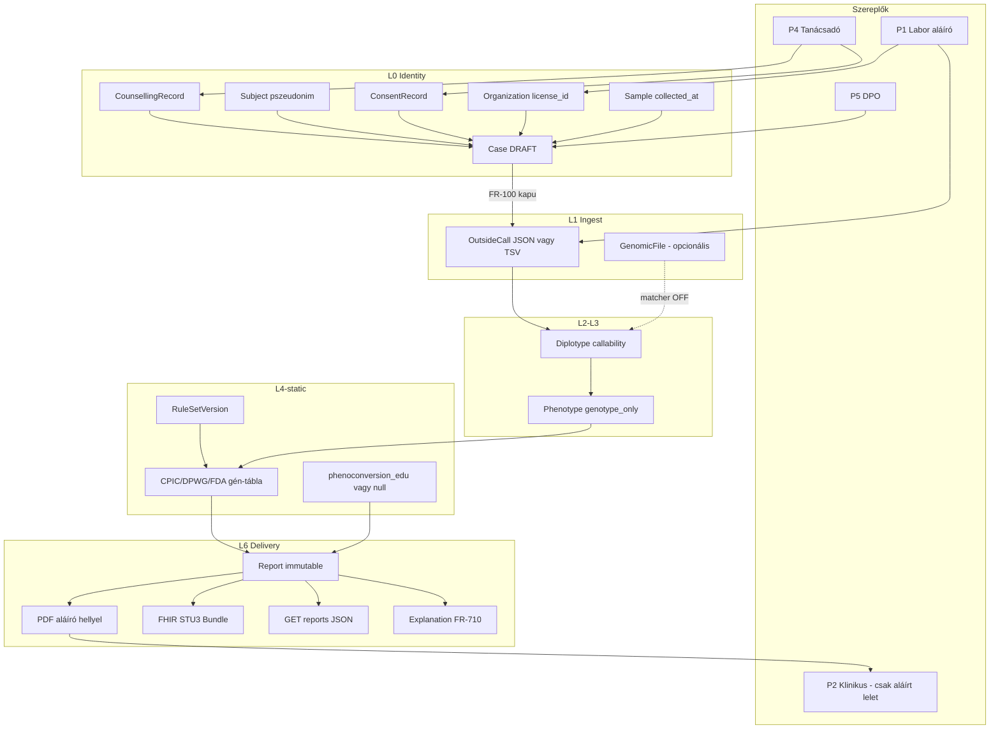
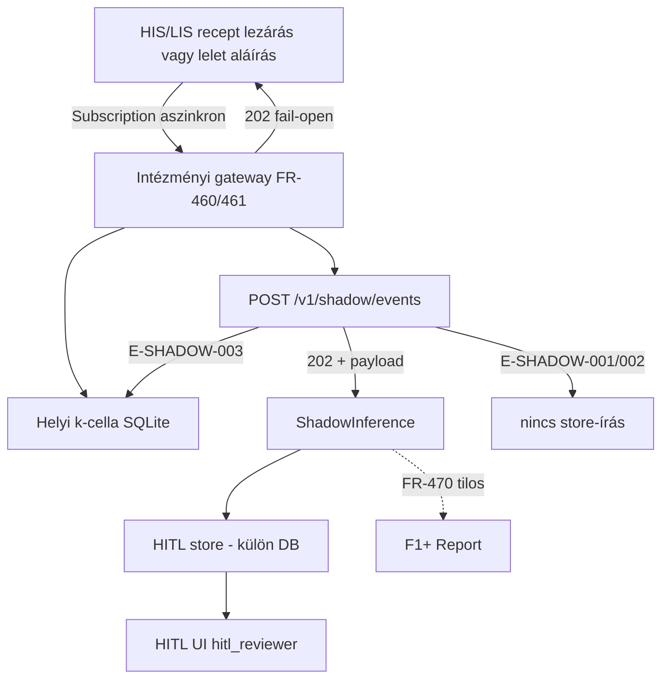
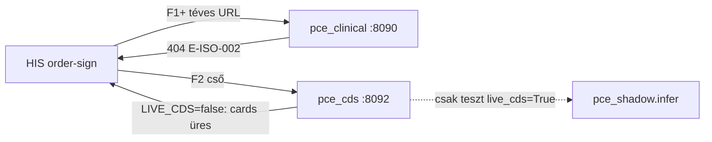

# Adatfolyam és felhasználói út (B.1 + §5)

| | |
| --- | --- |
| **Spec** | B.1, B.2, B.3, B.4, E.2, §5.1–5.2 |
| **Terv** | [DELIVERY-PLAN.md](DELIVERY-PLAN.md) |
| **Mérés** | [SPEC-PLAN-TRACE.md](SPEC-PLAN-TRACE.md) |

Két elkülönített út + egy lakattal zárt F2 cső. Keverés a klinikai UI-n = NG-07/08. SYN-en mindhárom **ugyanazokkal** a B-szerződésekkel fut, élő HIS/TAJ nélkül.

## 1. Klinikai path (F1+) — laborlelet

**Invariánsok**

- L4-static-nak **nincs** `MedicationEntry` / `medications` argumentuma. A lelet a gén guideline-tábláját listázza, nem a felírásból szűr.
- `functional_phenotype` / `live_findings` / `hitl_*` **nincs** a Report JSON-ban.
- Render **409** `E-CONSENT-001..005`, ha a kapu piros — a CLI sem kerülheti meg (FR-100: admin sem).
- Fail-closed a szivárgásra (nincs shadow a PDF-en). A HIS-t ez az út nem blokkolja (nincs HIS a klinikai pathen).

**SYN állapot (2026-08-13 P06u):** a 8 API-lépés HTTP-n zöld (`tests/test_clinical.py`). UI: `src/pce_ui/index.html`, `python -m pce_clinical --mode serve`.

**API sorrend (B.3 / B.4) — labor egy műveletsor**

1. `POST /v1/orgs` + `POST /v1/subjects` + `POST /v1/cases` → `DRAFT`
2. `POST /v1/cases/{id}/counselling` (occurred_at < sample.collected_at)
3. `POST /v1/cases/{id}/consent` (8. § scopes)
4. `POST /v1/cases/{id}/outside-calls` (vagy TSV)
5. `POST /v1/cases/{id}/reports` → kapu → JSON/PDF/FHIR; status `SIGNED` csak aláíró slot kitöltése után
6. `GET /v1/cases/{id}/reports/{rid}`
7. `GET /v1/cases/{id}/explanation` (FR-710)
8. Visszavonás: `POST /v1/subjects/{id}/withdraw` → riport URL `410` `E-GONE-010`

Opcionális: `PUT /v1/cases/{id}/clinical-context` **tárol** a kutatási úthoz. Az aláírt JSON/PDF **nem** ebből a listából készül (FR-220).

---

## 2. Shadow path (F1s) — HITL, nem klinikai kimenet

**Invariánsok**

- HIS **nem** vár a PCE-re (E.2 fail-open).
- `clinician` → `/v1/hitl/**` = `E-ISO-001`.
- ShadowInference **soha** nem FK a Report-ra.
- F1+ JSON: zárt B.4.1 kulcskészlet; `medications` / `clinical_context` / `hitl_*` reject. A lelet-összeállítás **nem** tölti a gyógyszerlista-táblát.
- ANON: nincs ResearchConsent kapu. PSEUDO: `E-CONSENT-006`.
- Vak mód: 1. lépés motor nélkül; 2. lépés AGREE/DISAGREE.

**HITL kártya (anonim):** `case_display_id`, gén, CLASS vagy RAW a FR-461 szerint, **hatóanyag-kód** (WHO ATC 5. szint, 7 karakter; ha a DPO durvított: csoportkód), `config_id`. Nincs név, TAJ, születési év, orvosnév. Vak lépés után: `forras_allapot` (mi van / mi hiányzik magyarul).

**SYN állapot (2026-08-13 P06x):** a 5 lépés járható. Motor: `src/pce_shadow/`. Tár: `var/hitl.sqlite`. Képernyő: `src/pce_ui/hitl.html`, `python -m pce_hitl`. 7 karakteres paroxetin (`N06AB05`): gén szerinti normál metabolizáló megmarad, funkcionális szegény metabolizáló üres, a hiány ki van írva. 5 karakteres csoportkód (`N06AB`): párosítás szünetel.

---

## 3. Persona UX (SYN, pecsétig)

Minden képernyő a B API-t hívja. Nincs kitalált kórháznév; org = `SYN-ORG-001`.

| Persona | Képernyő / CLI | Happy path | Hibás path | Spec story |
| --- | --- | --- | --- | --- |
| **P4 Tanácsadó** | WP-U: tanácsadás + beleegyezés űrlap | dátum a mintavétel előtt; gén-scope pipák | későbbi dátum → `E-CONSENT-002` HU | 13, 14 |
| **P1 Labor** | WP-U: eset, outside-call feltöltés, előnézet, aláírás | kapu zöld → PDF + JSON + FHIR | kapu piros → nincs PDF; INDETERMINATE gén nem NORMAL | 1–4, 20 |
| **P2 Klinikus** | **nincs** vizit-UI F1+-on; F2: `pce_cds` lakat-UI | megkapja az aláírt PDF-et / FHIR-t a laborból | nem lát HITL-t; F1+ CDS 404; `pce_cds` üres `cards` | 6–10 cső PARTIAL, élő Card LOCK |
| **P3 Farmakológus** | HITL UI (nem napi vizit) | vak lépés, majd motor | `clinical_context=ABSENT` ha nincs lista | 11–12 |
| **P5 DPO** | audit export, törlési tanúsítvány, A14 monitor | CSV/JSON 30 éves séma; gateway quarterly_report | PII a monitorban = regresszió | 15, 16 |
| **P6 Vendor** | FHIR Bundle + írásos határ (OQ-03); CDS a `pce_cds`-re | STU3 DiagnosticReport | F1+ CDS 404; `pce_cds` 200 üres `cards` | 17, 18 |
| **HIS** | nem UI | 202, recept lezárul; CDS POST fail-open | gateway hiba is 202 a HIS felé; CDS timeout üres `cards` | 21 |

**F2/F3 UX (SYN, pecsétig):** `python -m pce_cds` (port 8092), `src/pce_ui/cds.html`. Discovery `enabled: false`. POST 200 üres `cards`. SMART stub üres capabilities. WP-F2. `LIVE_CDS` false. Az ON út csak teszt-paraméterrel (`live_cds=True`), nem a repo konstanssal.

---

## 4. Csatorna-izoláció (ellenőrizhető UX)

| Teszt | Elvárt |
| --- | --- |
| Labor PDF-ben `live_findings` / `functional_phenotype` | nincs |
| `Authorization: clinician` + `GET /v1/hitl/inferences` | 403/404 `E-ISO-001` |
| `GET /cds-services/pgx-order-sign` a `pce_clinical`-en | 404 `E-ISO-002` |
| `GET /cds-services` a `pce_cds`-en, `LIVE_CDS=false` | 200, `enabled: false` |
| `POST /cds-services/pgx-order-sign` a `pce_cds`-en, `LIVE_CDS=false` | 200, `cards: []` |
| Renderer kwargs `medications` | `RendererConfigError` |
| Gateway export `SYN-TAJ` / `doseQuantity` / INN (`escitalopram`) | nincs (a **kód** `N06AB10` van) |
| `pce_report` / `pce_clinical` forrásban `pce_cds` | nincs |

---

## 5. Teljes út — SYN gold (nincs zsákutca)

**F1+ klinikai út (WP-C+K+R+F+U+V) — járható**

1. Tanácsadó rögzít SYN counselling + consent (`SYN-MD-001` pecsétszám-hely, nem kitalált orvosnév a gitben: placeholder slot).
2. Labor feltölt `outside-call-cyp2d6-called.json`, **vagy** VCF-et (hiányzó definiáló pozíció → `INDETERMINATE`, nem NORMAL).
3. Kapu enged; report `config_id=pgx-prepare-12@v0`; a meghívott gén CPIC pair sorai (12 gén pin, F5/VKORC1 rec hiány jelezve); A.1.1 minden PDF oldalon.
4. Klinikus a PDF-et kapja — nincs belépése a HITL-re (`E-ISO-001`). A PDF a gén guideline-sorait listázza; nem a beteg aktuális felírásaiból szűrt figyelmeztetés.
5. INDETERMINATE: nincs NORMAL claim.
6. Visszavonás: riport URL `410` `E-GONE-010`.

**F1s kutatási út (WP-G+M+H) — járható**

1. Fixture HIS bundle → gateway → k-cella → `POST /v1/shadow/events`.
2. ANON 7 karakteres kód → 202 (párosítás, ha a kód hatóanyag-kód). TAJ → 400. HIS ettől függetlenül „lezárt”. 5 karakteres csoportkód → HITL sor, párosítás szünetel.
3. Továbbított esemény → ShadowInference a **hitl.sqlite**-ban.
4. Reviewer 1. lépés vak; 2. lépés verdict + `forras_allapot` (van/hiányzik).
5. Report store üres marad ettől az eseménytől.

---

## 6. F2 CDS path (lakat) — járható SYN-en, suggestion pecsétig LOCK

1. `PYTHONPATH=src python3 -m pce_cds --port 8092` → `LOCKED`.
2. `GET /cds-services` → `enabled: false`.
3. `POST /cds-services/pgx-order-sign` → 200 `cards: []`. A felírás nem blokkolt.
4. `GET /.well-known/smart-configuration` → üres capabilities, magyar lakat-üzenet.
5. IIa-safe párok: ha a teszt `live_cds=True`, info Card, nincs suggestion (`IIA_SAFE_BLOCK`).

